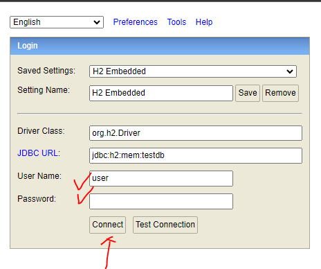
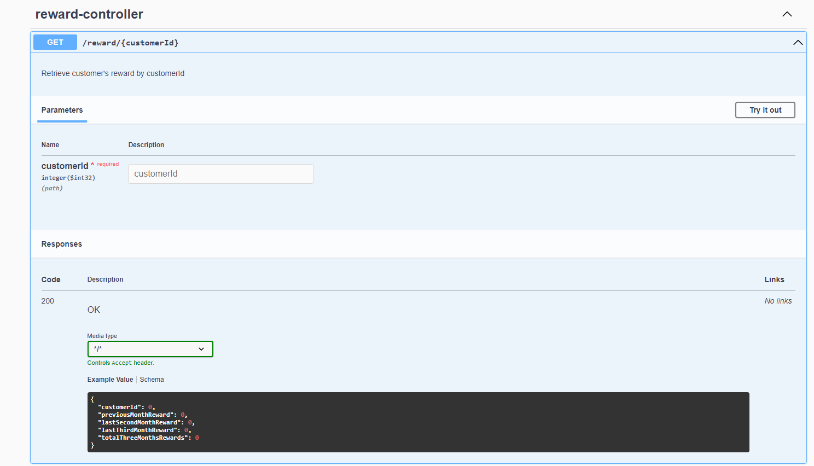

# Integration testing instruction
### 1. Plugin credentials in Environment variables
for example: H2_DB_USER_NAME=user;H2_DB_PASSWORD=passxxx

### 2. Run Application `SimpleApiApplication` with configured environment variables

### 3. Open up H2 in-memory db console via web-browser
link : (http://localhost:8081/h2-console/)

As set up in `application.properties`, host name is `jdbc:h2:mem:testdb`
with specified driver class

```angular2html
spring.datasource.url=jdbc:h2:mem:testdb
spring.datasource.driverClassName=org.h2.Driver
```
typing in username and password will allow to query console



### 4. Copy-paste an entire query from the script file and execute
query script localtion `src/main/resources/init-script.sql`

### 5. Open Swagger and test each features, or test with Postman request

link: (http://localhost:8081/swagger-ui/index.html)

Main feature endpoint will be `/reward/{customerId}`




# Unit test instructions

### - Run with gradle :test